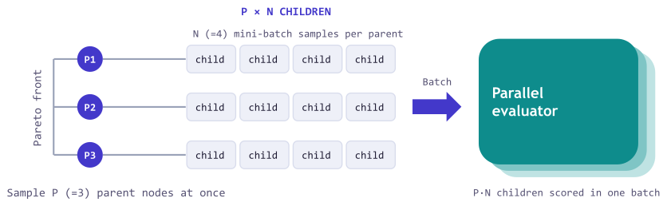

---
date:
  created: 2026-07-30
authors:
 - ben
 - lakshya
 - shangyin
 - donghyun
 - lutfi
 - dan
 - koushik
 - alex
 - matei
equal_contribution:
  - "Jialin Zhang"
  - "Lakshya A Agrawal"
  - "Shangyin Tan"
  - "Donghyun Lee"
slug: parallel-proposals
readtime: 10
title: "Batching the Reflective Optimization Loop: Parallel Proposals Make GEPA Faster and Better"
description: "GEPA now supports proposing and evaluating a batch of candidates on each optimization step instead of one candidate at a time. In our sweep on two tasks, most batched runs finished in half the wall-clock time or less, and the fastest in about a quarter to a third. Batched settings also achieved higher held-out test scores: from 68.9% to 72.1% on LiveBench-Math (with 2×2) and from 49.0% to 60.0% on HoVer (with 8×1)."
social_image: blog/2026-07-30-parallel-proposals/images/throughput.png
citation_keywords: "text optimization, prompt optimization, program optimization, parallel proposals, batched inference, Pareto optimization, GEPA, LiveBench, HoVer, multi-hop retrieval"
---

# Batching the Reflective Optimization Loop: Parallel Proposals Make GEPA Faster and Better

<figure markdown="span">
  ![Two scatter plots of held-out test performance against optimization wall-clock time. In each, a purple dot labeled Parallel Proposals (P×N) sits above and left of an orange diamond labeled Sequential, inside a shaded region of results that are both faster and better; a dashed line marks the unoptimized baseline, and two arrows from the diamond point up (Better than single mutation) and left (Faster than single mutation). LiveBench-Math: 71.6% in 2.5 hours against 68.9% in 7.7 hours. HoVer: 55.0% in 15 minutes against 49.0% in 47 minutes.](images/throughput.png){ style="width: 100%;" }
  <figcaption>Figure 1. At the same metric-call budget, parallel proposals are faster and better than single mutation, achieving up to about a 3 to 4× speedup, while scoring up to 11 points higher on the held-out test set.</figcaption>
</figure>

Running GEPA on a task can take hours because each optimization step waits for a proposal and its evaluation before the next step begins. In each iteration, GEPA samples a parent, proposes a mutation, evaluates it on a mini-batch, and, if it improves on its parent, evaluates it on the full validation set.

This release adds batched parallel proposals. Instead of advancing one proposal at a time, a step can propose several candidates and dispatch their evaluations concurrently. This allows for evaluating more proposals at a time, so the same budget of metric calls finishes in less wall-clock time, and it delivers better results, by exploring more of the search tree per step. In our experiments, batching cut the wall-clock time by roughly 3 to 4×, while raising held-out test scores from 68.9% to 72.1% on LiveBench-Math and from 49.0% to 60.0% on HoVer.

Faster and better optimization makes GEPA more accessible and practical for more tasks, and lets you spend more budget in the same amount of time. Beyond the released features, we also introduce the axes of parallel scaling in reflective optimization, a potential area for future study.

## How parallel proposals work

The mechanism is closely analogous to batch Bayesian optimization[^batchopt], which proposes and evaluates a batch of candidates per round rather than adapting after every single one. Similar to how GEPA uses a Pareto frontier instead of a single best numerical score to select candidates, parallel proposals push the idea further by drawing several extensions of the frontier within each step (Figure 2), thus reducing how often the search adapts to the validation set. [Prior work](https://www.science.org/doi/10.1126/science.aaa9375) also shows that repeatedly steering decisions with one fixed holdout can inflate its apparent performance, so committing to more proposals simultaneously should transfer better beyond the validation set.

<figure markdown="span">
  ![Three schematic search trees, with Pareto-front candidates in orange and each step's proposals in indigo. Left, SelectBestCandidate: only the single best candidate is orange and circled, and it proposes one indigo mutation. Middle, Pareto-based candidate sampling: three orange frontier candidates sit in different subtrees; the circled one is sampled and proposes one indigo mutation. Right, parallel proposals: the same orange frontier, where two circled members each propose three indigo mutations, grouped in a dashed box labeled "P×N proposals per step".](images/concept_sampling.svg){ style="width: 100%;" }
  <figcaption>Figure 2. From best-candidate selection to parallel proposals, SelectBestCandidate extends only the current best candidate, GEPA's Pareto-based candidate sampling explores a broader tree one proposal at a time, and parallel proposals (P×N) extend several frontier candidates at once.</figcaption>
</figure>

Standard GEPA advances one proposal per step, extending a single candidate drawn from its Pareto frontier. Parallel proposals sample several parents from the frontier, draw several reflective mutations of each, and score all of the proposals concurrently (Figure 3).

<figure markdown="span">
  { style="width: 100%;" }
  <figcaption>Figure 3. One batched iteration. GEPA samples P parents from the frontier, draws N reflective mutations for each parent, and scores all P·N children in one parallel evaluation. This lets GEPA propose more candidates in each iteration while paying the iteration latency once.</figcaption>
</figure>

??? note "One P×N step in detail"

    In the new P×N sampling strategy, one GEPA step:

    1. samples P parents from the current Pareto frontier;
    2. draws N mini-batches per parent and evaluates each parent on them through `batch_evaluate()`, producing P·N reflection requests;
    3. dispatches the reflection requests concurrently;
    4. screens the proposals by batch-evaluating them again on their mini-batches;
    5. evaluates accepted candidates on the full validation set in parallel, then updates the frontier.


## Runtime Analysis

Write $T(k)$ for the wall-clock time of a run with $k = P \cdot N$ proposals per step, so that $T(1)$ is a single-mutation run. It is the sum of the time spent on each iteration. Every iteration incurs a step latency $L_{\text{step}}$ for the $k$ reflection calls and $k$ mini-batch evaluations, which run concurrently. Whenever one or more proposals beat their parent on the mini-batch, the iteration additionally pays a full-validation latency $L_{\text{val}}$ to evaluate all accepted proposals on the validation set in parallel.

The metric-call budget determines the total number of proposals a run can afford, whether parallel or sequential (if we assume the candidate acceptance rate stays the same). The number of iterations is the number of proposals divided by $k$, so a width-$k$ run needs about $1/k$ as many iterations as single mutation. The main bottleneck is full validation. If each proposal is accepted with probability $a$, and proposal outcomes are independent, then an iteration triggers full validation with probability

$$q_k = 1 - (1-a)^k,$$

which grows with $k$. Multiplying the per-iteration cost by the number of iterations gives the speedup of a width-$k$ run over single mutation,

$$\frac{T(1)}{T(k)} \approx \frac{k\,(L_{\text{step}} + a\,L_{\text{val}})}{L_{\text{step}} + q_k\,L_{\text{val}}}.$$

In practice, two effects slow wide steps down. First, the reflection stage takes as long as the slowest of its $k$ concurrent calls, so $L_{\text{step}}$ grows with width. Second, evaluation can be limited by the worker pool. A validation stage can carry up to $k$ accepted candidates, each evaluated on all $V$ validation examples, so with $W$ concurrent workers and a per-rollout latency of $T_e$,

$$L_{\text{val}} \approx \begin{cases} T_e & \text{if } kV \le W, \\ (kV/W)\,T_e & \text{if } kV > W. \end{cases}$$

According to strong scaling[^scaling], a run with a budget of $B$ metric calls needs at least $B \cdot T_e / W$ of wall-clock time for evaluation alone when $W$ is fixed. This bound is most relevant for system-bound workloads, where available CPU or cluster capacity is genuinely fixed. In agent optimization workloads evaluated against large-scale inference services, however, the worker pool can often be increased substantially. By raising the number of workers in the pool, we expect to further lower this bound.

## Results


We evaluated parallel proposals on [LiveBench-Math](https://livebench.ai/) and [HoVer](https://hover-nlp.github.io/), where the optimized agent is selected using a validation set and then measured on a held-out test set. For both tasks, we used `gpt-5-mini` as the proposer. As in standard GEPA runs, we measured the optimization budget by the number of metric calls. One metric call corresponds to evaluating one candidate on one example. Every setting on a task received the same total metric-call budget.

??? note "Task setup details"

    - **[LiveBench-Math](https://livebench.ai/)** asks a model to solve competition math problems (AMC and AIME questions, symbolic algebra, and olympiad problems), graded by LiveBench's own scorers, with the [Terrarium](https://github.com/gepa-ai/terrarium) split of 100 training, 100 validation, and 168 test problems. Budget: 5,000 metric calls, each one a `gpt-4.1-mini` solution attempt.
    - **[HoVer](https://hover-nlp.github.io/)** asks a system to gather the Wikipedia pages needed to verify a multi-hop claim. We optimize the two components (a query writer and a note taker) of a four-hop `gpt-4.1-mini` retrieval agent over a BM25 index of 5.2 million 2017 Wikipedia abstracts, on three-hop claims split into 200 training, 150 validation, and 200 test claims; one rollout makes about eight calls. During optimization, GEPA scores each rollout by the fraction of the claim's three gold pages that appear in the retrieved pages (top-5 recall), as shown by the validation curves and test stars in Figures 5 and 6. The headline numbers in the text and in Figures 1 and 4 are the share of test claims with all three gold pages retrieved. Budget: 3,000 metric calls, each one a full program rollout.

### Batching cuts the wall-clock time and scores higher on held-out tests

We ran evaluations with up to 512 concurrent workers on LiveBench-Math and 64 on HoVer. The measured runs (Figure 4) align with the runtime model above, cutting the wall-clock time by about 3 to 4× at 16-way parallelism. For example, on LiveBench-Math, moving from single mutation to 2×2 cut the number of iterations by 4.9× (219 to 45), but the fraction of iterations that triggered full validation rose from 17% to 53%, so the run gained a 1.9× speedup (7.7 to 4.1 hours).

<figure markdown="span">
  ![Two dual-axis line charts across the nine settings from single to 8×2: an orange line with held-out test performance on the left axis, a purple line with optimization time on the right axis, a dashed lighter-purple curve with the optimization time predicted under each task's worker pool (512 for LiveBench-Math, 64 for HoVer) and a dotted baseline. Measured time falls from 7.7 hours to about 2 on LiveBench-Math and from 47 to 14 minutes on HoVer, and the predicted curve tracks it, flattening near 2.2 hours and 15 minutes. Test performance ranges from 66.7 to 72.1 on LiveBench-Math and from 49.0 to 60.0 on HoVer against single mutation's 68.9 and 49.0.](images/scaling_lines.png){ style="width: 100%;" }
  <figcaption>Figure 4. As the per-step width P·N scales up, runtime falls with diminishing returns. The finite-worker prediction matches the measured runtimes. Most settings perform as well as or better than single mutation on test, and the best setting scores much higher.</figcaption>
</figure>

Figure 4 also shows that most batched settings match or beat single mutation on the held-out tests, and the best settings reach 72.1% against 68.9% on LiveBench-Math (2×2) and 60.0% against 49.0% on HoVer (8×1).

### Scaling parents (P) vs. mutations (N)

In principle, larger P extends more members of the frontier at once, which should help when no single generally good candidate exists and the frontier holds genuinely different specialists worth advancing in parallel, and larger N draws more mutations with different mini-batches, which should help when the dataset is rich enough to expose many distinct directions to improve one candidate. LiveBench-Math is the second case, with problems spanning multiple areas, so giving each parent several mutations (larger N) transferred better to test than spreading single mutations across more parents (larger P). HoVer additionally keeps a more complementary candidate pool, where different candidates succeed on different claims, and its test scores tend to grow with both P and N. With P held at 2, test scores rise with N from 68.6 at 2×1 to 71.6-72.1 at 2×2 through 2×8 on LiveBench-Math, and from 52.5 to 55.0 on HoVer (as shown in Figure 4). Generally, we observe scaling N improves performance on both tasks, even though the highest-scoring split remains task-dependent (2×2 on LiveBench-Math, 8×1 on HoVer). We leave further ablations on other budgets and parallelisms for future work.

### Batched settings are more budget-efficient

We also probed how efficiently each setting spends its budget during the run. Here we compare a batched setting, 2×4, against single mutation on both tasks.

#### More quality per metric call

2×4 dominates small budgets: on LiveBench-Math it reaches validation scores that single mutation needs about 2,000 calls to match, and on HoVer it leads at every budget. Single mutation raises validation scores later in the budget, but still scores lower on the held-out test set on both tasks.

<figure markdown="span">
  { style="width: 100%;" }
  <figcaption>Figure 5. Best validation quality against metric calls consumed, for single mutation and 2×4. 2×4 dominates small budgets and scores higher on the held-out test set.</figcaption>
</figure>

On the held-out test sets, 2×4 won 3.0pp over single mutation on LiveBench-Math and 6.0pp on HoVer. The validation scores tell a different story: on LiveBench-Math, single mutation scored higher on validation but lower on test. Its generalization gap (the drop from validation score to test score) was nine points, against only two for 2×4. On HoVer, both settings' test scores landed above their validation scores, and 2×4 ended higher on both. This is consistent with the hypothesis above, that committing to more proposals before adapting to the validation set transfers better beyond it.

#### More quality per dollar

By measuring the total LLM spend during optimization (sum of solver calls and reflection calls), we found that the batched setting is also cost-efficient, reaching strong validation scores within the first few dollars. On LiveBench-Math, 2×4 reaches its final validation score within about $4 of spend, and on HoVer it passes single mutation's final validation score within about $2.6. The total spend stays comparable across settings, within the $12 to $16 range.

<figure markdown="span">
  { style="width: 100%;" }
  <figcaption>Figure 6. Best validation quality against total LLM spend, solver and reflection calls combined. The batched setting reaches strong validation quality within the first few dollars.</figcaption>
</figure>

## Getting started

Parallel proposals are available in [gepa](https://github.com/gepa-ai/gepa) since v0.1.4. Opt in with a simple setting change below. The sampling strategy says how many candidates to propose per step, and the selection strategy says which of the improved candidates to keep. For example, two parents with two mutations each gives four candidates per step.

```python
from gepa.optimize_anything import optimize_anything, OptimizeAnythingConfig
from gepa.strategies.proposal_sampling import PxNSampling
from gepa.strategies.proposal_selection import AllImprovements

config = OptimizeAnythingConfig(
    engine="gepa",
    max_concurrency=64,
    engine_config={
        "engine": {
            "sampling_strategy": PxNSampling(p=2, n=2),   # 2 parents, 2 mutations each = 4 per step
            "selection_strategy": AllImprovements(),
        },
        "reflection": {"reflection_lm": "gpt-5-mini"},
    },
)

result = optimize_anything(
    seed_candidate=seed, evaluator=evaluate,
    dataset=trainset, valset=valset, objective=objective, config=config,
)
```

GEPA by default calls your `evaluate` function in parallel, so set `max_concurrency` high enough to match the capacity of your evaluator and inference provider. For system-bound evaluations, `max_concurrency` may be constrained by available CPU, GPU, or cluster capacity. For API-backed optimization, much larger worker pools may be practical, subject to provider rate limits and budget. Optionally, you may provide a custom `batch_evaluate` function via the `batch_evaluator` argument. Since the GEPA engine remains single-threaded and dependency-free, the parallelism is entirely yours to choose. You can plug in any concurrency or distributed-execution framework (Ray, Slurm, Modal, Daytona, [Harbor](https://harborframework.com/), and more) to run your evaluations, and any inference backend that supports batch completion to run reflections in parallel, with no changes to GEPA itself. You may also choose or define other sampling and selection strategies. See the [API reference](https://gepa-ai.github.io/gepa/api/) for more details.

## Appendix: Axes of parallel scaling

<figure markdown="span">
  { style="width: 100%;" }
  <figcaption>Figure 7. Scaling axes for the optimization step: more parents per step (P), more mutations per parent (N), and a larger reflection mini-batch per mutation (ComBEE).</figcaption>
</figure>

Parallel proposals fit into the bigger picture of scaling each reflection optimization step along several axes. P controls how many programs are selected for mutation at each step, and N controls how many mutations are proposed for each selected program. A third axis is the size of the reflection mini-batch per mutation: approaches like [ComBEE](https://gepa-ai.github.io/gepa/blog/2026/04/09/gepa-at-scale-with-combee/) scale along this axis by reflecting on larger mini-batches of examples and rollouts through a map-reduce-style pipeline. Finally, a fourth axis is the compute spent within each reflection step. It can be turned up by using stronger reflection programs ranging from a single LM call to chain-of-thought, multi-step pipelines, or agentic workflows such as [Claude Code](https://gepa-ai.github.io/gepa/guides/claude-cli-as-proposer/). In each case, more compute is spent to produce a higher-information mutation at each step.

With this, GEPA now supports four independently tunable dials for spending more optimization compute per step: P, N, reflection mini-batch (ComBEE), and reflection compute (reflection LM, agentic proposers). They interact through a shared optimization budget (metric calls, tokens, or dollars). Parallel proposals are one way to spend it. The open question is how to allocate a fixed optimization budget across these dials, and this work is a first look at that trade-off.

[^batchopt]: David Ginsbourger, Rodolphe Le Riche, and Laurent Carraro, "[Kriging is well-suited to parallelize optimization](https://link.springer.com/chapter/10.1007/978-3-642-10701-6_6)," 2010.
[^scaling]: Gene M. Amdahl, "[Validity of the single processor approach to achieving large scale computing capabilities](https://dl.acm.org/doi/10.1145/1465482.1465560)," AFIPS 1967.
